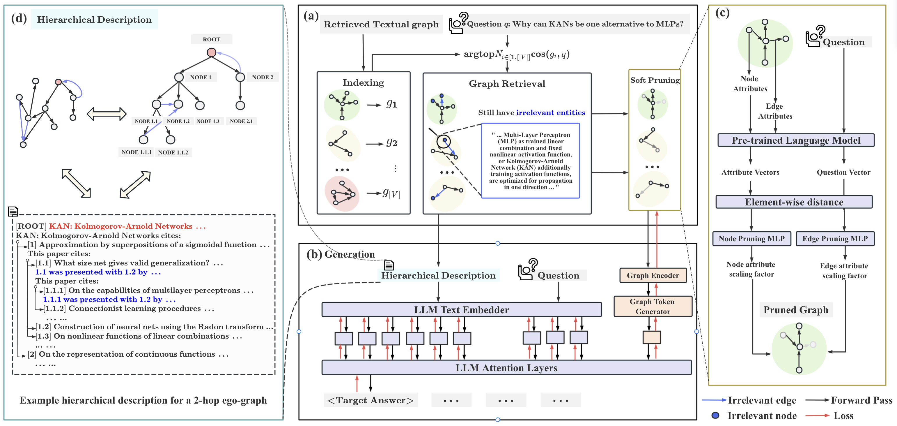

## GRAG: Graph Retrieval-Augmented Generation

[](https://arxiv.org/abs/2405.16506)

Naive Retrieval-Augmented Generation (RAG) methods are not aware of the topological information of the retrieved documents / knowledge graphs, and using only text information cannot solve graph question answering scenarios:


We introduce **GRAG**, retrieving relevant subgraphs instead of just discrete entities. The generation of LLM is controlled by the query and the relevant text subgraph:


## Try GRAG

### 1) Data Preprocessing
```
python -m src.dataset.preprocess.expla_graphs
python -m src.dataset.expla_graphs
```

### Training
```
# GRAG with the frozen LLM
python train.py --dataset expla_graphs --model_name graph_llm

# GRAG with fine-tuned LLM by LoRA
python train.py --dataset expla_graphs --model_name graph_llm --llm_frozen False
```

## Acknowledgements

- Thanks to the [gpt-fast](https://github.com/pytorch-labs/gpt-fast) project for its code.
- Thanks to the [G-Retriever](https://github.com/XiaoxinHe/G-Retriever) contributors for their valuable work and open source contributions.

